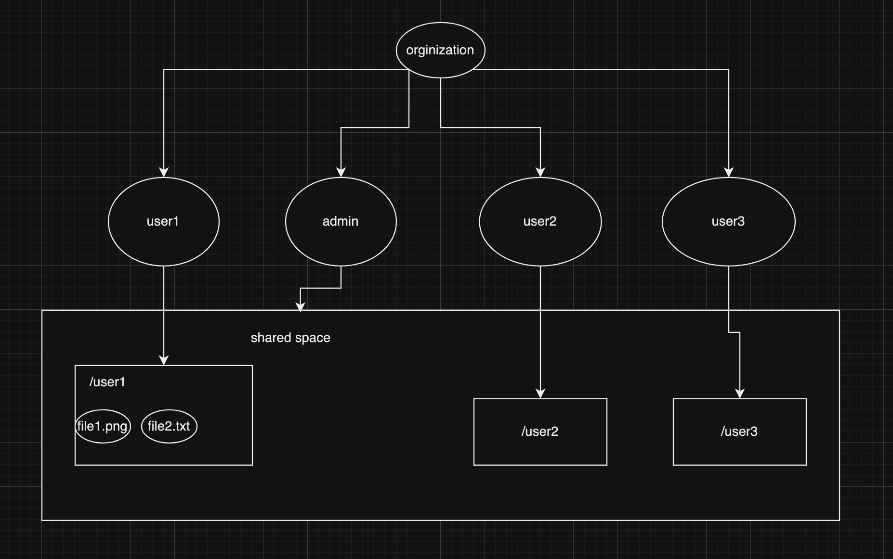
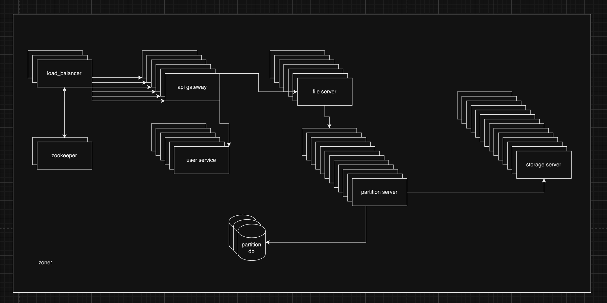

# Distributed File Storage System Design

## Table of Contents

1. [Agenda](###Agenda)
2. [Introduction](###introduction)
3. [Requirements](###requirements)
4. [Data Hierarchy](###data-hierarchy)
5. [Architecture](###architecture)
6. [Technologies](###technologies)
7. [Data Model](###data-model)
8. [Flows](###flows)
9. [Api Endpoints](###api-endpoints)
10. [Capacity Estimation for a million users](###capacity-estimation-for-a-million-users)
11. [Fault Tolerance](###fault-tolerance)


### Agenda

Agenda of this article is to design a distributed storage system that can store and retrieve files. The system should be
scalable, fault-tolerant, and highly available.
Initially system is designed to work for one million users and 100 TB of data. The system should be able to store files
of size upto 10 GB.

### Introduction

A distributed storage system is a system that stores data on multiple nodes. The data is distributed across the nodes in
the system. The system should be able to store and retrieve files. The system should be scalable, fault-tolerant, and
highly available. The system admin can monitor the system and perform maintenance tasks like adding new nodes, removing
nodes, and rebalancing the data.

### Requirements

1. The system should be able to store and retrieve files.
2. The system should be scalable, fault-tolerant, and highly available.
3. The system should be able to store files of size upto 10 GB.
4. The system should grantee data availability.
5. The system should be able to handle one million users and 100 TB of data.
6. There should be user authentication and authorization.
7. The system should be able to handle concurrent requests.
8. There should be 10gb of free data storage for each user and above that user has to pay 1$ per 10gb

### Data Hierarchy



- on top of the hierarchy, we have the organization.
- organization can have single or multiple users.
- every organization has the storage pool which is /org/<org-name>
- admin can have the access of the whole storage pool i.e. /org/<unique-org-name>
- every user has a personal space which is /org/<unique-org-name>/home/<unique-user-name>
- every org has a public space which is /org/<unique-org-name>/public, where every user can store and retrieve files.
- every file created with read all permissions has a reference in the public space and if the file is deleted from the
  user's space, the reference is deleted from the public space.

### Architecture



- above is a very high-level architecture of the system.
- the system has multiple servers, each server has different purposes like zookeeper, compute, storage, load balancer,
  file server, and api gateways.
- there are multiple data centers, each data center has multiple servers which are at different location.
- every zone are equipped with the load balancer which is responsible for distributing the load among the api gateway.
- there can be multiple api gateways in a zone, the load balancer is responsible for distributing the load among the api
  gateways.
- the distribution of the load is done based on the round-robin algorithm.
- all the servers are connected to the zookeeper which is responsible for maintaining the configuration of the servers
  as well as the keeping record of the healthy server.
- the api gateway is responsible for handling the incoming requests and forwarding them to the appropriate server.
- based on the base api path the request is forwarded to the appropriate microservice.
- the file server is responsible for storing and retrieving the files.
- the partition service is responsible for partitioning the data and storing it on multiple servers.
- the partition service is responsible for storing the metadata of the files as well.

### Technologies

```text
role and permisison : LDAP
backend: Rust
frontend: React
database: Cassandra
cache: Redis
message broker: Kafka
logs and monitoring: Prometheus, Grafana
```

### Data Model

1. **`server`**

   | **Column**          | **Type**      | **Description**                                    |
         |---------------------|---------------|----------------------------------------------------|
   | `server_id`         | INT           | Unique identifier for the server.                 |
   | `ip_address`        | VARCHAR(50)   | IP address of the server.                         |
   | `hostname`          | VARCHAR(255) | Hostname of the server.                           |
   | `status`            | ENUM          | Current status (`active`, `inactive`, `failed`).  |
   | `created_at`        | TIMESTAMP     | When the server was added.                        |
   | `updated_at`        | TIMESTAMP     | When the server was last updated.                 |
   | `last_heartbeat`    | TIMESTAMP     | Timestamp of the last heartbeat check.            |
   | `server_type_id`    | INT           | Foreign key to `server_type`.                     |
   | `storage_type_id`   | INT           | Foreign key to `storage_type`.                    |
   | `region_id`         | INT           | Geographic region of the server.                  |

2. **`server_type`**

   | **Column**         | **Type**      | **Description**                                    |
         |---------------------|---------------|----------------------------------------------------|
   | `type_id`           | INT           | Unique identifier for server type.                |
   | `type_name`         | VARCHAR(100)  | Name of the server type (e.g., `zookeeper`).       |
   | `configuration`     | TEXT          | JSON or detailed config settings for the type.    |
   | `created_at`        | TIMESTAMP     | When the server type was added.                   |
   | `updated_at`        | TIMESTAMP     | When the server type was last updated.            |

3. **`storage_type`**

   | **Column**         | **Type**      | **Description**                                    |
         |---------------------|---------------|----------------------------------------------------|
   | `type_id`           | INT           | Unique identifier for storage type.               |
   | `type_name`         | VARCHAR(100)  | Name of the storage type.                         |
   | `configuration`     | TEXT          | JSON or detailed config for the storage.          |
   | `created_at`        | TIMESTAMP     | When the storage type was added.                  |
   | `updated_at`        | TIMESTAMP     | When the storage type was last updated.           |

4. **`organization`**

   | **Column**          | **Type**      | **Description**                                    |
         |----------------------|---------------|----------------------------------------------------|
   | `org_id`            | INT           | Unique identifier for the organization.           |
   | `name`              | VARCHAR(255)  | Name of the organization.                         |
   | `created_at`        | TIMESTAMP     | When the organization was created.                |
   | `updated_at`        | TIMESTAMP     | When the organization was last updated.           |
   | `shared_storage_pool_id` | INT     | Foreign key to `shared_storage_pool`.             |
   | `owner_id`          | INT           | Foreign key to the owner user in `user`.          |

5. **`user`**

   | **Column**          | **Type**      | **Description**                                    |
         |----------------------|---------------|----------------------------------------------------|
   | `user_id`           | INT           | Unique identifier for the user.                   |
   | `org_id`            | INT           | Foreign key to `organization`.                    |
   | `name`              | VARCHAR(255)  | Name of the user.                                 |
   | `email`             | VARCHAR(255)  | Email address of the user.                        |
   | `password`          | VARCHAR(255)  | Encrypted password of the user.                   |
   | `created_at`        | TIMESTAMP     | When the user was created.                        |
   | `updated_at`        | TIMESTAMP     | When the user was last updated.                   |

6. **`shared_storage_pool`**

   | **Column**          | **Type**      | **Description**                                    |
         |----------------------|---------------|----------------------------------------------------|
   | `pool_id`           | INT           | Unique identifier for the storage pool.           |
   | `total_storage`     | BIGINT        | Total storage allocated (in MB).                  |
   | `total_used`        | BIGINT        | Total storage used (in MB).                       |
   | `org_id`            | INT           | Foreign key to `organization`.                    |
   | `created_at`        | TIMESTAMP     | When the pool was created.                        |
   | `updated_at`        | TIMESTAMP     | When the pool was last updated.                   |

7. **`folder`**

   | **Column**         | **Type**    | **Description**                                |
         |--------------------|-------------|------------------------------------------------|
   | `folder_id`        | INT         | Unique identifier for the folder.              |
   | `user_id`          | INT         | Foreign key to `user`.                         |
   | `org_id`           | INT         | Foreign key to `organization`.                 |
   | `name`             | VARCHAR(255)| Name of the folder.                            |
   | `parent_folder_id` | INT         | Self-referencing foreign key to parent folder. |
   | `created_at`       | TIMESTAMP   | When the folder was created.                   |
   | `updated_at`       | TIMESTAMP   | When the folder was last updated.              |
   | `permission`       | VARCHAR(255)| permission string (rwx------)                  |

8. **`file_data`**

   | **Column**          | **Type**       | **Description**                                |
         |----------------------|----------------|------------------------------------------------|
   | `file_id`           | INT            | Unique identifier for the file.                |
   | `folder_id`         | INT            | Foreign key to `folder`.                       |
   | `user_id`           | INT            | Foreign key to `user`.                         |
   | `org_id`            | INT            | Foreign key to `organization`.                 |
   | `name`              | VARCHAR(255)   | Name of the file.                              |
   | `size`              | BIGINT         | File size (in bytes).                          |
   | `data`              | BYTEA          | Metadata for quick access (not actual file).   |
   | `created_at`        | TIMESTAMP      | When the file was created.                     |
   | `updated_at`        | TIMESTAMP      | When the file was last updated.                |
   | `permission`       | VARCHAR(255)   | permission string (rwx------)                  |

9. **`file_blob_data`**

   | **Column**          | **Type**      | **Description**                                    |
         |----------------------|---------------|----------------------------------------------------|
   | `blob_id`           | INT           | Unique identifier for the file chunk.             |
   | `file_id`           | INT           | Foreign key to `file_data`.                       |
   | `data`              | BYTEA         | Actual binary data of the chunk.                  |
   | `created_at`        | TIMESTAMP     | When the chunk was created.                       |
   | `updated_at`        | TIMESTAMP     | When the chunk was last updated.                  |
   | `partition_index`   | INT           | Order of the chunk for reconstruction.            |

```text
server_type [zookeeper, compute, storage, load_balancer, file_server, api_gateways, ldap server]
```

### Flows

1. Adding a new organization

```text

- user will send a register request to the https://api.example.com/register
- the request will first hit the load balancer which will forward the request to the api gateway.
- the api gateway will forward the request to the user service.
- the user service will create a new organization and a new user.
- the user service will create a new organization and user entity in the database. with the shared storage pool.
- the user service will create base folder entities for the organization as bellow.

organization
+----+------+---------+---------------------+------------+---------------+
| id | name | owner_id| shared_storage_pool_id | created_at | updated_at |
+----+------+---------+---------------------+------------+---------------+
|  1 | org1 |    2    |          3          |  1/2/2024  |  1/2/2024     |
+----+------+---------+---------------------+------------+---------------+


user
+----+-------+-------+-----------------+----------+------------+------------+
| id | org_id| name  | email           | password | created_at | updated_at |
+----+-------+-------+-----------------+----------+------------+------------+
|  2 |   1   | user1 | user1.gmail.com | password |  1/2/2024  |  1/2/2024  |  // this one is the default root user
|  3 |   1   | user2 | user2.gmail.com | password |  1/2/2024  |  1/2/2024  |  // this is the user which is created by the root user
+----+-------+-------+-----------------+----------+------------+------------+


shared_storage_pool
+----+------------------+--------------+-------+------------+-------------+
| id | total_storage(mb)| total_used(mb)| org_id| created_at | updated_at |
+----+------------------+--------------+-------+------------+-------------+
|  4 |    1024000       |     100      |   1   |  1/2/2024  |  1/2/2024   |    
+----+------------------+--------------+-------+------------+-------------+

folder
+----+---------+-------+---------+----------------+------------+------------+
| id | user_id | org_id|  name   | parent_folder_id| created_at | updated_at |
+----+---------+-------+---------+----------------+------------+------------+
|  5 |    2    |   1   | /       |      NULL      |  1/2/2024  |  1/2/2024  |  // this is the root folder
|  6 |    2    |   1   | /home   |        5       |  1/2/2024  |  1/2/2024  |
|  7 |    2    |   1   | /public |        5       |  1/2/2024  |  1/2/2024  |  // any one can add the file here
|  8 |    3    |   1   | /root   |        5       |  1/2/2024  |  1/2/2024  |  // this is the root default space (user1)
|  8 |    3    |   1   | /user2  |        6       |  1/2/2024  |  1/2/2024  |  // this is the user1 default space
+----+---------+-------+---------+----------------+------------+------------+

```

2. Adding a new user

```text
once the organization is created the admin user can add the new users and assign the roles and permissions to the
users. which will be saved in the ldap server.
```

3. Adding a new file

```text
- user will send a post request to the https://api.example.com/org1/home/user1/file
- the request will first hit the load balancer which will forward the request to the api gateway.
- the api gateway will authenticate the token and forward the request to the file service.
- the file service will get the information of the user and organization and the shared storage pool information.
- the file service will break the file into chunks and push the chunks into the kafka queue.
- each chunk will have a partition index started from 0 to n.
  {file_id, data, created_at, updated_at, partition_index}
- at the same time file service will store the metadata of the file in the database.
- the partition service will consume the chunks asynchronously from the kafka queue and store the chunks in the storage server.


file_data
+----+---------+-------+---------+----------------+------------+-------------+------------+-----------+
| id | user_id | org_id|  name   | parent_folder_id| created_at | updated_at | permission | file_type |
+----+---------+-------+---------+----------------+------------+-------------+------------+-----------+
|  9 |    2    |   1   | file1   |        8       |  1/2/2024  |  1/2/2024  |  rwx------  |   txt     |
+----+---------+-------+---------+----------------+------------+-------------+------------+-----------+

file_blob_data
+----+---------+-------------------+---------+---------------+-----------------+
| id | file_id |        data       | created_at | updated_at | partition_index |
+----+---------+-------+-----------+----------------+--------+-----------------+
|  10|    9    |  long-binary-data |  1/2/2024  |  1/2/2024  |       0         |
|  11|    9    |  long-binary-data |  1/2/2024  |  1/2/2024  |       1         |
+----+---------+-------+-----------+----------------+--------+-----------------+

```

4. Retrieving a file

```text
- user will send a get request to the https://api.example.com/file/org1/home/user1/file1
- the request will first hit the load balancer which will forward the request to the api gateway.
- the api gateway will authenticate the token and forward the request to the file service.
- the file service will check if the user has the read access of the requested file or not.
- the file service will get the metadata of the file from the database.
- the file service will get the chunks of the file from the storage server based on the file data.
- the file service will combine the chunks and send the file to the user along with the metadata information.
```

there are many more flows that can be added to the system like deleting the file, updating the file, sharing the file.

### Api Endpoints

```text
# add a new organization
- POST      /register
- PUT       /org/{org-id}                                                   // update the organization
- DELETE    /org/{org-id}                                                   // delete the organization


# user
- POST      /org/{org-name}/user                                            // add a new user
- PUT       /org/{org-name}/user/{user-id}                                  // update the user
- DELETE    /org/{org-name}/user/{user-id}                                  // delete the user
- PUT       /org/{org-name}/user/{user-id}/role                             // update the role of the user

# file
- POST      /org/{org-name}/home/{user-name}/file                           // add file to the user's space with default permission is rwx------
- POST      /org/{org-name}/public/file                                     // add file to the public space with default permission is rwxr-xr-x
- PUT       /org/{org-name}/home/{user-name}/file/{file-id}                 // update the file ( here the file binaries is updated and chunks are re-written)
- DELETE    /org/{org-name}/home/{user-name}/file/{file-id}                 // soft delete the file
- PUT       /org/{org-name}/home/{user-name}/file/{file-id}/permission      // update the permission of the file
- POST      /org/{org-name}/home/{user-name}/file/{file-id}/share           // share the file with the other user ( it will take the list of user id)

# folder
- POST      /org/{org-name}/home/{user-name}/{folder-path}                   // add folder to the user's space
- POST      /org/{org-name}/public/{folder-path}                             // add folder to the public space
- PUT       /org/{org-name}/home/{user-name}/{folder-path}                   // update the folder ( only admin can update the folder)
- DELETE    /org/{org-name}/home/{user-name}/{folder-path}                   // delete the folder


# there will be other end for the system admin to monitor the system and perform the maintenance tasks.

# Monitoring
- GET       /monitoring/server/{server-id}                                   // get the server information
- GET       /monitoring/server/{server-id}/logs                              // get the server status
- GET      /monitoring/server/{server-id}/metrics                            // get the server metrics
```

### Capacity Estimation for a million users

- Average user storage: 15GB free.
- Total storage: ( 1M * 15GB = 15PB ).
- Replication factor: 3.
- Effective storage: ( 15PB * 3 = 45PB ).
- max size hard disk available is 32TB.
- Number of hard disk required: ( 45PB / 32TB = 1406 ).
- Number of servers required: ( 1406 / 10 = 141 ). // as one server can have 10 hard disk slots.


### Fault Tolerance

- the whole system is designed to be fault-tolerant.
- the system has the replication factor of 3.
- from starting load balancer to the storage server, every component is designed to be fault-tolerant which means each
  component is a distributed component.
- the system has the monitoring and alerting system which will notify the admin in case of any failure.
- the system has the auto-scaling feature which will add the new server in case of any failure.
- the system has the backup and restore feature which will help in case of any data loss.

---
