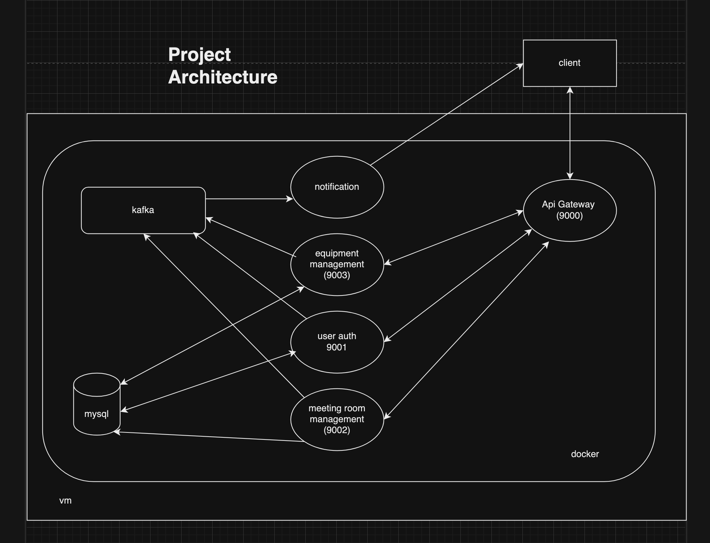
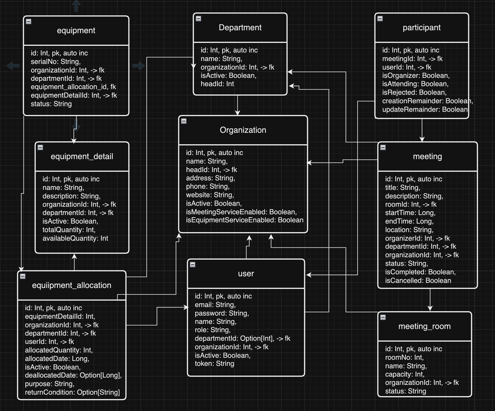
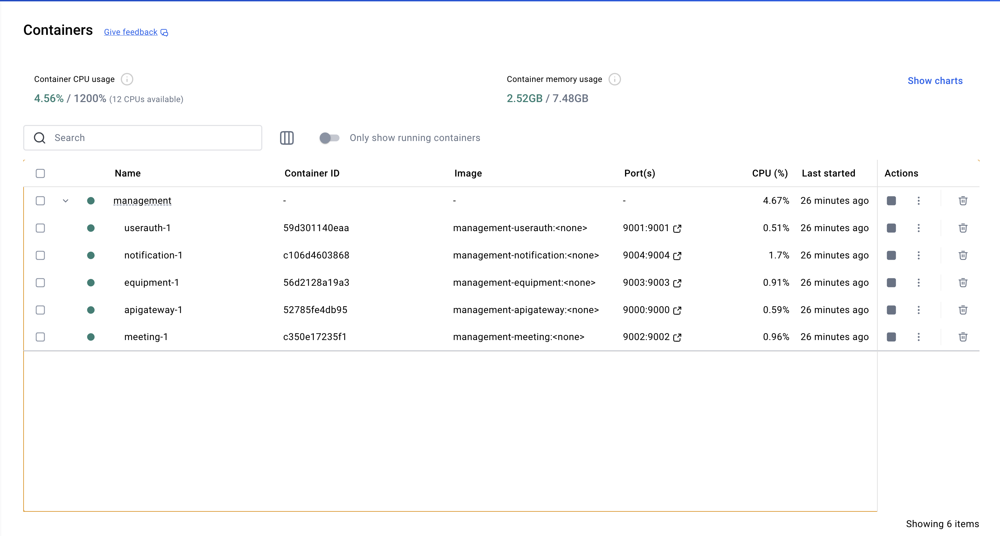

# Management

## Overview

This application is a simple management system for a small business. It allows organizations to manage their meeting
rooms and equipment.
This also comes with a user management system that allows the organization to manage their users.

## Features

- **Organization Management**: view, update, and delete organizations.
- **Department Management**: view, create, update, and delete departments.
- **User Management**: view, create, update, and delete users.
- **Meeting Rooms**:View, Create, update, and delete meeting rooms.
- **Equipment**:View, Create, update, and delete equipment.

## Architecture



- It is a microservice-based architecture.
- It is built using text, play, akka, quartz scheduler, kafka, mysql and docker.
- There are 5 service
    - Api Gateway
    - UserAuthentication
    - Meeting service
    - Equipment service
    - Notification service
- Each service is a separate microservice
- only the api gateway is exposed to the outside world
- All the services are behind the api gateway
- The api gateway is responsible for authenticating user and route the request to the appropriate service with the
  additional headers
  like the user id, organization id, and department id.
- All other service are internally following the role base access control

## Service accessed

During the time of organization onboarding, the organization will be asked to provide the following services

- **Equipment Service**: This service is responsible for managing the equipment.
- **Meeting Service**: This service is responsible for managing the meeting rooms.

on the base of the service permission the organization will be able to use that services.

## Roles

There are 4 roles in the system

- **super_admin** : This role has access to all the application apis.
- **admin** : This role has access to the organization level apis excluding creating and deleting the organization.
- **dept_admin** : This role has access to the department level apis excluding orgs apis and creating and deleting the
  department apis.
- **user** : This role has access to the all the apis of the org excluding the org, department and user creating apis.

On the base of the combination of service access and the roles the user will access the application apis.

## API Permission

### User

- **Role**: user
- **Permissions**:
    - Read User
    - Read Organization
    - Read Department
    - Read Meeting
    - Read Equipment
    - Create Meeting

### Department Head

- **Role**: department_admin
- **Permissions**:
    - Create User
    - Update User
    - Delete User
    - Update Meeting
    - Delete Meeting
    - Create Equipment
    - Update Equipment
    - Delete Equipment
    - All permissions of the User role

### Admin

- **Role**: admin
- **Permissions**:
    - Update Organization
    - Create Department
    - Update Department
    - Delete Department
    - All permissions of the Department Head role

### Super Admin

- **Role**: super_admin
- **Permissions**:
    - Delete Organization
    - Create Organization
    - All permissions of the Admin role

## Entities



### Organization

```text
  id: Int,
  name: String,
  headId: Int, -> foreign key
  address: String,
  phone: String,
  website: String,
  isActive: Boolean,
  isMeetingServiceEnabled: Boolean,
  isEquipmentServiceEnabled: Boolean
```

### Department

```text
  id: Int,
  name: String,
  organizationId: Int, -> foreign key
  isActive: Boolean,
  headId: Int
```

### User

```text
  id: Int,
  email: String,
  password: String,
  name: String,
  role: String,
  departmentId: Option[Int], -> foreign key
  organizationId: Int, -> foreign key
  isActive: Boolean,
  token: String
```

### Equipment

```text
  id: Int,
  serialNo: String,
  organizationId: Int, -> foreign key
  departmentId: Int, -> foreign key
  equipmentDetailId: Int, -> foreign key
  status: String
```

### EquipmentDetail

```text
  id: Int,
  name: String,
  description: String,
  organizationId: Int, -> foreign key
  departmentId: Int, -> foreign key
  isActive: Boolean,
  totalQuantity: Int,
  availableQuantity: Int

```

### EquipmentAllocation

```text
  id: Int,
  equipmentDetailId: Int,
  organizationId: Int, -> foreign key
  departmentId: Int, -> foreign key
  userId: Int, -> foreign key
  allocatedQuantity: Int,
  allocatedDate: Long,
  isActive: Boolean,
  deallocatedDate: Option[Long],
  purpose: String,
  returnCondition: Option[String]
```

### MeetingRoom

```text
  id: Int,
  roomNo: Int,
  name: String,
  capacity: Int,
  organizationId: Int, -> foreign key
  status: String
```

### Meeting

```text
  id: Int,
  title: String,
  description: String,
  roomId: Int, -> foreign key
  startTime: Long,
  endTime: Long,
  location: String,
  organizerId: Int, -> foreign key
  departmentId: Int, -> foreign key
  organizationId: Int, -> foreign key
  status: String,
  isCompleted: Boolean,
  isCancelled: Boolean
```

### Participant

```text
  id: Int,
  meetingId: Int, -> foreign key
  userId: Int, -> foreign key
  isOrganizer: Boolean,
  isAttending: Boolean,
  isRejected: Boolean,
  creationRemainder: Boolean,
  updateRemainder: Boolean
```

## Meeting Service

- at onboarding the organization will be asked to enable the meeting service
- the head of org or department head managing the meeting service, it has to add the list of meeting rooms
- on the base of meeting room availability the meeting will be scheduled and room is allocated
- once the meeting is created the kafka producer in the meeting service push meeting reminder detail to kafka.
- the kafka consumer in the notification service will consume the message and send the reminder to the participants of
  the meeting and the meeting management team
- there will be two types of remainder
    - creation remainder
    - meeting started remainder

## Equipment Service

- at onboarding the organization will be asked to enable the equipment service
- the head of org or department head managing the equipment service, it has to add the list of equipment details and
  list of equipment follows the details.
- the equipment can be allocated to the user and the user has to return the equipment after the use.
- once the equipment is allocated the equipment is marked as allocated and the kafka producer in the equipment service
  push equipment remainder detail to kafka.
- once the equipment is deallocated the equipment is marked as available and the kafka producer in the equipment service
  push thank you email along with the equipment condition detail to user.


### Containers

